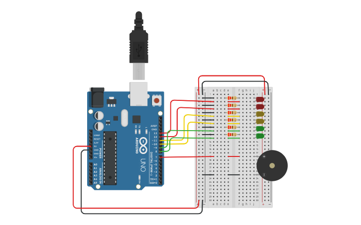

# Documentación Dojo 1


## Integrantes
---
* Campos Tomás
* Atoche Luis
* Escobar Rodrigo
* Tomas Blanco Rivas

## Proyecto: Semáforo
---


## Descripción
---
Desarrollo de un semáforo de 2 leds de cada color y señalización para personas no videntes para el gobierno de la ciudad.
1. El verde dura 45 segundos.
    * No suena.
2. El amarillo dura 5 segundos.
    * Suena 1 vez cada 2 segundos en tono suave
3. El rojo dura 30 segundos
    * Suena 1 vez por segundo en tono fuerte
  
### Materiales
* 1 ARDUINO.

* 1 PROTOBOARD.

* 6 LEDS.

* 1 BUZZER.

* RESISTENCIAS NECESARIAS PARA CADA COMPONENTE.

## Función principal
---
La función se encarga de enceder y apagar el buzzer.

BUZZER es un #define que se utiliza para agregar el buzzer asociado a un pin de la placa de arduino.

El buzzer prende con una frecuencia recibida, durante un tiempo recibido, luego se apaga por el mismo tiempo. Se repite según la cantidad de repeticiones recibida por parámetro.

```C++
void PrenderBuzzer(int frecuencia, int tiempo, 
                   int cantidadDeRepeticiones)
{
   for (int i = 0; i < cantidadDeRepeticiones; i++) 
  {
    tone(BUZZER, frecuencia); 
    delay(tiempo); 
    noTone(BUZZER); 
    delay(tiempo); 
  }
}
```

## Link al proyecto
---
* [Proyecto](https://www.tinkercad.com/things/hijpSlfEKqc-dojo-numero-uno/editel?sharecode=yMJo4kDGngdaIehbVo61OfxuESmT3GVonthiMxD7vPU)